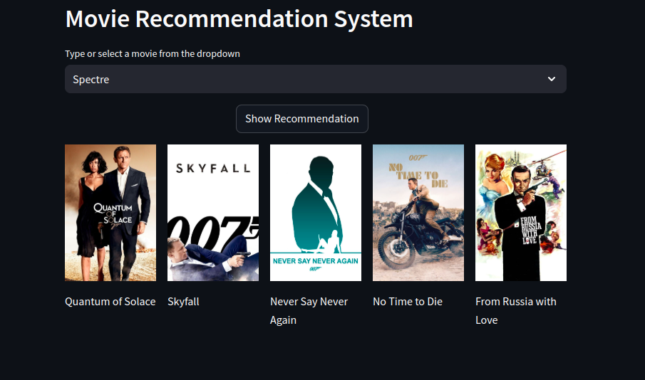

# Project: Movie Recommendation System Using Machine Learning!


This project implements a **Movie Recommendation System** that suggests movies similar to the one selected by the user. The system uses **content-based filtering**, leveraging movie metadata like genres, cast, crew, and plot descriptions to calculate similarity scores.

#### Key Features:
- **Content-Based Recommendations**: Uses cosine similarity to find movies with similar content.
- **Customizable Suggestions**: Users receive personalized recommendations based on the input movie.
- **Efficient Preprocessing**: Combines key features into a unified "tags" column for improved similarity computation.

#### How It Works:
1. Preprocessed movie metadata is converted into numerical vectors using **CountVectorizer**.
2. A similarity matrix is generated using **cosine similarity**.
3. Given a movie title, the system identifies and ranks the most similar movies.
4. Top 5 recommendations are presented to the user.

This simple and effective system demonstrates how machine learning and natural language processing can enhance user experiences in entertainment applications.


# Demo:




# Dataset used:

* [Dataset link](https://www.kaggle.com/datasets/virajraut25/tmdb-6000-dataset)

# How to run?
### STEPS:

Clone the repository

```bash
https://github.com/entbappy/Movie-Recommendation-System-Using-ML.git
```
### STEP 01- Create a conda environment after opening the repository

```bash
conda create -n movie python=3.11 -y
```

```bash
conda activate movie
```


### STEP 02- install the requirements
```bash
pip install -r requirements.txt
```


```bash
#run this file to generate the models

Preprocessing.ipynb
```

Now run,
```bash
streamlit run app.py
```


```bash
Author: Ibraheem
ML Engineer
Email: olabintanibraheem@gmail.com

```
